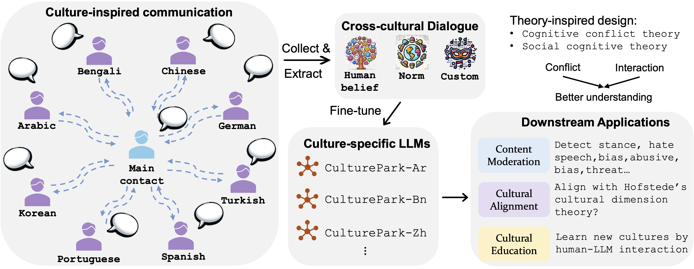

# CulturePark: Boosting Cross-cultural Understanding of Large Language Models (NeurIPS 2024)

<center class ='img'>

</center>

## Introduction

Cultural bias is pervasive in many large language models (LLMs), largely due to the deficiency of data representative of different cultures. Typically, cultural datasets and benchmarks are constructed either by extracting subsets of existing datasets or by aggregating from platforms such as Wikipedia and social media. However, these approaches are highly dependent on real-world data and human annotations, making them costly and difficult to scale. Inspired by cognitive theories on social communication, this paper introduces \textit{\method}, an LLM-powered multi-agent communication framework for cultural data collection. CulturePark simulates cross-cultural human communication with LLM-based agents playing roles in different cultures. It generates high-quality cross-cultural dialogues encapsulating human beliefs, norms, and customs. Using CulturePark, we generated 41,000 cultural samples to fine-tune eight culture-specific LLMs. We evaluated these models across three downstream tasks: content moderation, cultural alignment, and cultural education. Results show that for content moderation, our GPT-3.5-based models either match or outperform GPT-4 on 41 datasets. Regarding cultural alignment, our models surpass GPT-4 on Hofstede's VSM 13 framework. Furthermore, for cultural education of human participants, our models demonstrate superior outcomes in both learning efficacy and user experience compared to GPT-4. CulturePark proves an important step in addressing cultural bias and advancing the democratization of AI, highlighting the critical role of culturally inclusive data in model training.

Paper link: https://arxiv.org/pdf/2405.15145

## Table of Contents

- [Requirements](#requirements)
- [Usage](#usage)
  - [1. Data Augmentation](#1-data-augmentation)
    - [1.1. In-cultural Communication](#11-in-cultural-communication)
    - [1.2. Cross-cultural Communication](#12-cross-cultural-communication)
  - [2. Fine-tune your own CulturePark](#2-fine-tune-your-own-culturepark)
  - [3. Fine-tune CulturePark-Llama-70b-chat](#3-fine-tune-culturepark-llama-70b-chat)
  - [4. Experiment in our paper](#4-experiment-in-our-paper)

## Requirements

```bash
pip install jsonlines fire scikit-learn torch==2.0.0 transformers bitsandbytes accelerate
pip install openai
pip instal nltk
pip install -q -U google-generativeai
```

## Usage

### 1. Data Augmentation

- Download WVS file from https://www.worldvaluessurvey.org/WVSContents.jsp
- Download PEW file from https://huggingface.co/datasets/Anthropic/llm_global_opinions

#### 1.1. In-cultural Communication

```bash
python main.py --culture Arabic --v v1 --data_type wvq --cur_model gpt-3.5-turbo-0613 --g_num 500
```

Parameter: 
- culture: target culture. Now can select from Arabic, Bengali, Chinese, Germany, Korean, Portuguese, Spanish, Turkish. 
- v: communication style. v1 means self-guidance prompting. v2 means free chat.
- data_type: source of seed data.
- cur_model: model to power cross-cultural communication.
- g_num: generated data number


#### 1.2. Cross-cultural Communication

```bash
python main_cross.py --culture Arabic --v v1 --data_type wvq --cur_model gpt-3.5-turbo-0613 --g_num 500
```

Parameter: 
- culture: target culture. Now can select from Arabic, Bengali, Chinese, Germany, Korean, Portuguese, Spanish, Turkish. 
- v: communication style. v1 means self-guidance prompting. v2 means free chat.
- data_type: source of seed data.
- cur_model: model to power cross-cultural communication.
- g_num: generated data number

### 2. Fine-tune your own CulturePark

data_process.py is to process data for fine-tuning. 

- Step 1: Post process data. Run postProces() function.
- Step 2: Augment the answer. Run answerAug() function.
- Step 3: Finetune. Run finetune() function.
- (Optional) Step 4: format the data to finetune on Llama. Run generateData4Llama() function.

### 3. Fine-tune CulturePark-Llama-70b-chat

```bash
python llama_finetune.py --base_model "path_of_llama_70b" --new_model "path_of_new_model" --data_files "fine-tuning data path"
```

### 4. Experiment in our paper

You can reproduce the experiments in our paper according to code in https://github.com/Scarelette/CultureLLM/.

## Cite

```bash
@inproceedings{li2024culturepark,
  title={CulturePark: Boosting Cross-cultural Understanding in Large Language Models},
  author={Li, Cheng and Teney, Damien and Yang, Linyi and Wen, Qingsong and Xie, Xing and Wang, Jindong},
  booktitle={Thirty-Eighth Annual Conference on Neural Information Processing Systems (NeurIPS)},
  year={2024}
}
```

```bash
@inproceedings{li2024culturellm,
  title={Culturellm: Incorporating cultural differences into large language models},
  author={Li, Cheng and Chen, Mengzhou and Wang, Jindong and Sitaram, Sunayana and Xie, Xing},
  booktitle={Thirty-Eighth Annual Conference on Neural Information Processing Systems (NeurIPS)},
  year={2024}
}
```
